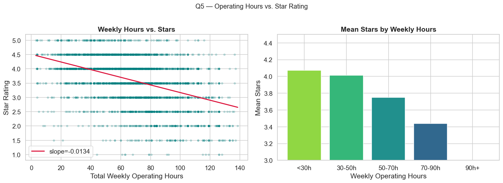
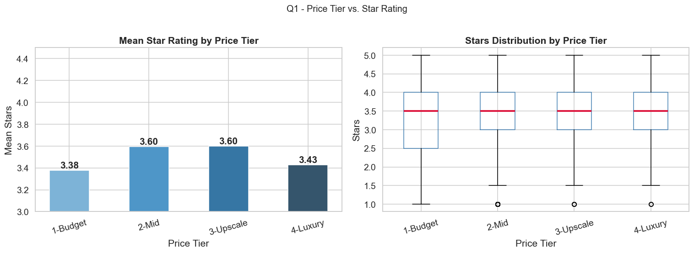
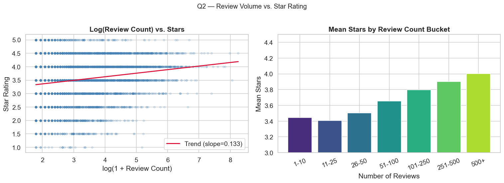
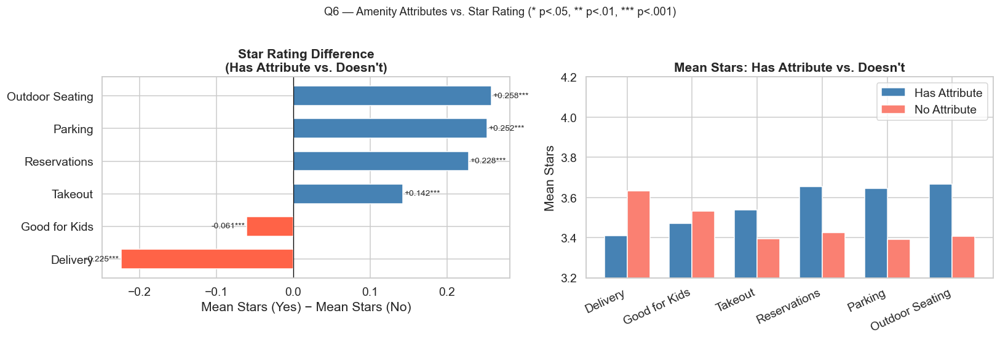
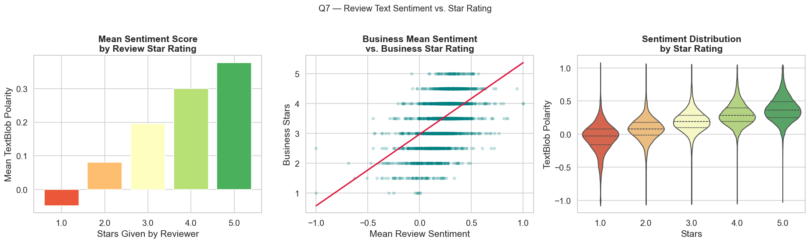
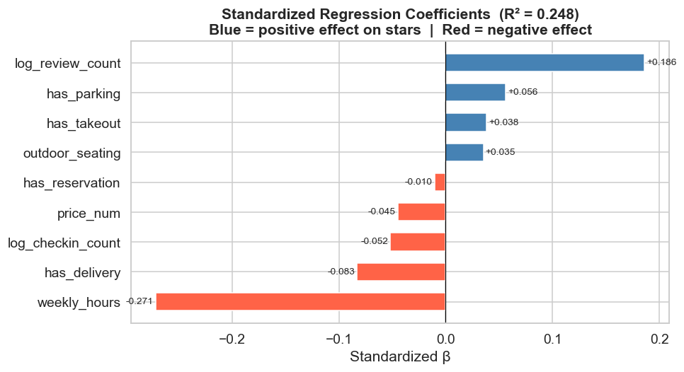

# Yelp Restaurant Ratings — What Actually Predicts a Star Rating?

> An exploratory analysis of 67,533 restaurants from the Yelp Open Dataset, across
> price, review volume, cuisine, geography, opening hours, amenities, and review
> sentiment — with an interactive Streamlit dashboard.

[](https://python.org)
[](https://streamlit.io)
[](https://www.yelp.com/dataset)


**Contributors:** He (Helen) Tu (lead), Siye Li
**Course:** ECON-UB 232 Data Bootcamp, NYU Stern — Spring 2026


---

## Overview

Yelp star ratings drive real revenue, but it is not obvious what a rating actually
measures. Is it food quality? Price? Popularity? This project takes the structural
features of a restaurant — the things visible on its profile before you read a
single review — and asks how much of the rating they explain.

The short answer: **not much, individually — and the most surprising predictor is
negative.**

## Key Results

Starting from 150,346 businesses, filtering to restaurants leaves **67,533 records
with 23 features**. Ratings are tightly clustered: mean **3.55 ★**, median 3.5,
standard deviation 0.85.

| Factor | Statistic | Direction |
| --- | --- | --- |
| **Weekly opening hours** | r = **−0.443** (p < 0.001) | Strongest single correlate — and negative |
| Review sentiment (TextBlob) | r = **+0.597** (p < 0.001) | Strong, but partly circular |
| Review volume (log) | r = **+0.180** (p < 0.001) | Weak but highly significant |
| Price tier | ANOVA **F = 330.79** (p < 0.001) | Significant, non-monotonic |
| City | ANOVA **F = 29.12** (p < 0.001) | Significant, small |
| **All 9 features combined** | **R² = 0.248** (n = 23,516) | Explains ~25% of variance |

### Longer hours, lower ratings

The clearest result in the dataset is that restaurants open more hours per week
score **worse** (r = −0.443). This is almost certainly not causal: long hours are
characteristic of fast-food and diner formats, which are rated on a different
implicit scale than destination restaurants.



### Price is not a ladder

Average rating by price tier is **non-monotonic** — it rises, then falls:

| Price tier | Mean stars | n |
| --- | --- | --- |
| `$` | 3.376 | 24,551 |
| `$$` | 3.595 | 29,817 |
| `$$$` | **3.598** | 2,306 |
| `$$$$` | 3.426 | 306 |

The most expensive restaurants average **3.43 ★** — barely above the cheapest tier,
and below both mid-tiers. The ANOVA is highly significant (F = 330.79), though with
only 306 restaurants in the `$$$$` bucket that top cell is thin.



### Popularity and rating rise together

| Review count | Mean stars | n |
| --- | --- | --- |
| 1–10 | 3.444 | 15,482 |
| 11–50 | 3.448 | 29,334 |
| 51–200 | 3.708 | 16,976 |
| 201–500 | 3.888 | 4,442 |
| 500+ | **4.002** | 1,299 |

Rating variance also *shrinks* as review count grows (std 0.981 → 0.422), which is
what you would expect if heavily-reviewed restaurants have converged on their true
quality while sparse ones are noisy.



### Amenities: convenience hurts, occasion helps

Mean rating difference between restaurants that have an attribute and those that
do not (all p < 0.001 except *Good for Kids*):

| Attribute | Δ mean stars |
| --- | --- |
| Outdoor Seating | **+0.258** |
| Parking | +0.252 |
| Reservations | +0.228 |
| Takeout | +0.142 |
| Good for Kids | −0.061 |
| **Delivery** | **−0.225** |

Delivery is the standout: offering it is associated with a *lower* rating. Together
with the hours result, the pattern suggests that attributes signalling convenience
correlate with formats that get rated harshly, while attributes signalling
occasion-dining correlate with higher ratings.



### Sentiment tracks stars, as it must

TextBlob polarity on 50,000 reviews correlates with per-review stars at **r = +0.597**
(mean polarity 0.267). This is the strongest relationship measured, but it is close
to tautological — it mostly validates that the sentiment model works, rather than
revealing anything about restaurants.



### Everything together explains a quarter of the variance

A linear regression on nine standardised features — log review count, price tier,
weekly hours, log check-ins, takeout, delivery, reservations, outdoor seating, and
parking — reaches **R² = 0.248** on 23,516 complete cases.

Three quarters of the variation in Yelp ratings is therefore *not* explained by any
structural feature of the restaurant. That is the honest headline: ratings are
mostly about things this dataset does not record.



---

## Getting Started

### 1. Clone and install

```bash
git clone https://github.com/HelenTu05/ECON-UB-232-Data-Bootcamp-Midterm.git
cd ECON-UB-232-Data-Bootcamp-Midterm
python -m venv .venv
source .venv/bin/activate   # Windows: .venv\Scripts\activate
pip install -r requirements.txt
```

### 2. Launch the dashboard

The cleaned dataset ships with the repository, so this works immediately:

```bash
streamlit run app.py
```

An eleven-page interactive dashboard with filters for price, city, cuisine, and
review count.

### 3. Re-run the analysis (optional)

Reproducing the notebook from scratch requires the raw Yelp JSON files — see
[data/README.md](data/README.md) for download instructions.

```bash
jupyter lab notebooks/01_yelp_eda.ipynb
```

---

## Repository Structure

```
ECON-UB-232-Data-Bootcamp-Midterm
├── app.py                          # Streamlit dashboard, 11 pages
├── notebooks/
│   └── 01_yelp_eda.ipynb           # full analysis, Q1-Q9
├── data/
│   ├── README.md                   # raw data download instructions
│   └── yelp_restaurants_clean.csv  # analysis-ready, 67,533 rows
├── figures/                        # plots exported by the notebook
├── images/                         # dashboard screenshot
├── reports/
│   └── presentation.pptx
├── requirements.txt
└── LICENSE
```

## Method

- **Source** — Yelp Open Dataset: 150,346 businesses, 131,930 check-in records,
  and a 200,000-review sample (160,834 of them for restaurants).
- **Filtering** — businesses whose category list contains "Restaurants", yielding
  67,533 rows and 23 engineered features.
- **Tests** — one-way ANOVA for categorical predictors, Pearson correlation for
  continuous ones, Mann-Whitney U for binary attribute comparisons, TextBlob for
  review polarity, and a standardised `LinearRegression` for the joint model.

## Limitations & Future Work

- **Correlational only.** Nothing here supports a causal reading; the hours and
  delivery results are almost certainly confounded by restaurant format, which is
  not controlled for.
- **Sentiment is near-circular.** Correlating review text polarity with review
  stars largely measures TextBlob, not restaurants.
- **The `$$$$` tier has only 306 restaurants**, so that cell of the price analysis
  is fragile.
- **R² = 0.248 is the ceiling here.** Adding cuisine and city as fixed effects, or
  moving to a non-linear model, is the obvious next step.
- **Reviews are a 200k sample**, not the full corpus, so the sentiment analysis is
  not representative of all restaurants equally.

## License

MIT — see [LICENSE](LICENSE).
