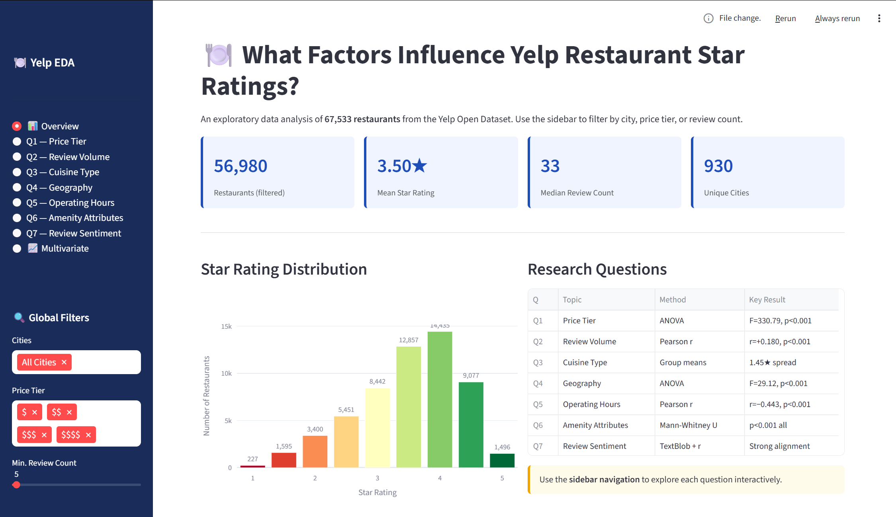

# 🍽️ Yelp Restaurant EDA — What factors influence star ratings?
### An Exploratory Data Analysis | Data Bootcamp Midterm Project

---

## Executive Summary

This project investigates what drives a restaurant's star rating on Yelp, using the publicly available **Yelp Open Dataset**. Drawing on 67,533 restaurant records across multiple U.S. and Canadian cities, we examine seven distinct dimensions — price tier, review volume, cuisine type, geographic location, operating hours, amenity attributes, and review text sentiment — to understand which factors most meaningfully predict whether a restaurant earns a high or low rating. Our analysis combines descriptive statistics, group comparisons (ANOVA, Mann-Whitney U tests), correlation analysis, natural language processing via TextBlob, and multivariate linear regression, yielding a consistent and interpretable picture of the Yelp rating ecosystem.

---

## 1. Introduction & Research Question

Online reviews have become the dominant mechanism through which consumers discover and evaluate restaurants. Yelp, one of the largest such platforms, aggregates crowd-sourced star ratings from 1 to 5 and hosts hundreds of millions of user reviews. Understanding what structural features of a restaurant predict its aggregate rating — as opposed to the idiosyncratic content of individual reviews — has practical implications for restaurant operators, investors, and platform designers alike.

**Central Research Question:** *What factors influence a restaurant's star rating on Yelp?*

We decompose this into nine sub-questions:

| # | Question | Method |
|---|----------|--------|
| Q1 | Does **price tier** affect star ratings? | One-way ANOVA + bar chart |
| Q2 | Does **review volume** correlate with ratings? | Pearson r + scatter plot |
| Q3 | Which **cuisine categories** rate highest/lowest? | Group means + horizontal bar |
| Q4 | Does **geographic location** explain ratings? | One-way ANOVA + map |
| Q5 | Do longer **operating hours** predict better ratings? | Pearson r + scatter plot |
| Q6 | Do **amenity attributes** (parking, delivery, etc.) matter? | Mann-Whitney U test |
| Q7 | Does **review sentiment** align with star ratings? | TextBlob polarity + correlation |
| Q8 | Does a restaurant's **rating change over time**? | Time-series + lifecycle analysis |
| Q9 | Does **popularity equal quality**? | Review volume+ check-in tiers + rating variance |

---

## 2. Data & Methods

### 2.1 Data Source

All data originate from the **Yelp Open Dataset** (https://www.yelp.com/dataset), a publicly released academic dataset. Three JSON-lines files were used:

- `yelp_academic_dataset_business.json` — 150,346 business records with location, category, attributes, and aggregate ratings
- `yelp_academic_dataset_review.json` — over 6 million individual reviews (we sample 200,000 for efficiency)
- `yelp_academic_dataset_checkin.json` — 131,930 records of user check-in activity

### 2.2 Data Cleaning & Feature Engineering

From the raw business file, we filtered to **restaurants only** using keyword matching on the `categories` field (terms: *restaurants, food, bars, fast food, cafes, desserts, bakeries*), yielding **67,533 restaurant records** — approximately 45% of all businesses in the dataset.

Key features engineered:

- **`price_num` / `price_label`**: Extracted from the nested `attributes` dictionary; mapped integer values (1–4) to `$`, `$$`, `$$$`, `$$$$` labels
- **`weekly_hours`**: Parsed the structured `hours` field to compute total operating hours per week across all open days
- **`log_review_count`** and **`log_checkin_count`**: Log-transformed (log1p) to reduce right-skew before correlation analysis
- **Amenity binary flags** (`has_takeout`, `has_delivery`, `has_reservation`, `has_wifi`, `good_for_kids`, `outdoor_seating`, `has_parking`): Extracted from the `attributes` dictionary and binarized
- **`cuisine`**: Extracted the most specific cuisine label from the comma-separated categories string
- **`sentiment`**: Computed TextBlob polarity scores for a random sample of 50,000 restaurant reviews

The final analytic dataset contains **23 features** across **67,533 rows**, satisfying the project requirement of ≥12 mixed-type features and ≥300 rows. Missing value rates vary by feature (e.g., `price_num` is missing for 10,553 records; `has_wifi` is missing for all records, as it was not reliably recorded).

---

## 3. Descriptive Statistics

The target variable — **star rating** — is right-skewed with a mean of **3.55★** and a median of **3.5★**. The modal rating is **4.0★** (n=16,774), followed by **3.5★** (n=14,383). Fewer than 500 restaurants (0.7%) received the minimum 1.0★. The distribution's left tail is thin: poor ratings are relatively rare in the Yelp ecosystem, consistent with a documented "positivity bias" in online reviews, where dissatisfied customers are less likely to leave reviews than satisfied ones.


Other key descriptive statistics:
- **Average review count**: 75.1 (median: 27) — highly right-skewed, with a maximum of 7,568
- **Average weekly operating hours**: 67.3 (median: 68), ranging from under 1 hour to 168 hours
- **Average check-in count**: 153.8 (median: 42) — again highly skewed

---

## 4. Analysis & Results

### Q1 — Price Tier vs. Star Rating

A one-way ANOVA comparing mean star ratings across the four price tiers reveals a statistically significant effect (**F = 330.79, p < 0.001**). However, the relationship is non-monotonic and nuanced.

Mid-range restaurants ($$: mean = **3.60★**) and upscale restaurants ($$$: mean = **3.60★**) both outperform budget restaurants ($: mean = **3.38★**). Strikingly, luxury establishments ($$$$) average only **3.43★** — barely above the budget tier. This inverted-U pattern likely reflects heightened expectations: diners at expensive restaurants apply stricter standards when rating, eroding the rating advantage that price otherwise confers. Budget restaurants may also suffer from genuine quality limitations, while mid-range restaurants hit the "sweet spot" of value-for-money satisfaction.

Box plots confirm that all four tiers share near-identical medians (3.5★) and IQRs, indicating that price explains differences in means but not the full shape of the distribution.


### Q2 — Review Volume vs. Star Rating

The Pearson correlation between log(1 + review count) and star rating is **r = +0.180 (p < 0.001)** — a weak but statistically significant positive association. The bucket analysis makes this trend visually clear: restaurants with 1–10 reviews average ~3.45★, while those with 500+ reviews average ~4.00★. The log-scale scatter plot shows a positive trend line (slope = 0.133).

This relationship likely reflects **survivorship bias**: restaurants accumulating large numbers of reviews tend to be popular and successful, and quality drives both popularity and ratings. It is also possible that review inflation plays a role — very high-review-count establishments may attract fans more than critics.


### Q3 — Cuisine Type vs. Star Rating

Among the top 20 most common cuisines (each with ≥30 restaurants), there is a spread of nearly **1.5 stars** between the highest and lowest-rated categories. **Specialty Food** leads with a mean of **4.01★** (n=1,142), followed by **Desserts** (3.97★) and **Bakeries** (3.92★). These niche categories likely attract enthusiast audiences with lower complaint thresholds.

At the bottom, **Fast Food** averages just **2.56★** (n=2,227), with **Burgers** (low-3★ range) and **Chicken Wings** not far above. **Pizza** (3.28★) and **Chinese** (3.34★) — despite being two of the most popular categories — rate below the overall mean of 3.55★, possibly due to high volume generating more diverse (and critical) reviewers.

The overall mean line (3.55★) cleanly bisects the cuisine chart, with artisanal/specialty categories consistently above it and high-volume fast-casual categories below.


### Q4 — Geographic Location vs. Star Rating

A one-way ANOVA of city-level mean ratings is also significant (**F = 29.12, p < 0.001**), confirming that geography explains some variance in ratings. Among 15 major cities analyzed, **Santa Barbara, CA** leads at **3.88★**, followed by **New Orleans, LA** (3.76★). At the lower end, **Metairie, LA** averages just **3.41★** and **Tucson, AZ** averages **3.50★**.

The geographic scatter plot shows that ratings are broadly distributed across the continental U.S. and Canada (Edmonton appears in the dataset), with no strong spatial clustering visible at the macro level. Local cultural norms around reviewing behavior, the composition of restaurant categories in each city, and average cost-of-living may all contribute to city-level differences.


### Q5 — Operating Hours vs. Star Rating

Contrary to an intuitive expectation that "busier = better," operating hours show a **negative correlation** with star rating (**r = −0.443, p < 0.001**). The slope in the scatter plot (−0.0134 stars per additional weekly hour) indicates that restaurants open fewer hours per week tend to rate higher.

The binned bar chart confirms this: restaurants open fewer than 30 hours per week average ~**4.07★**, while those open 70–90 hours average ~**3.44★**. This pattern has a plausible interpretation: shorter-hours restaurants tend to be specialty, artisanal, or fine-dining establishments (e.g., a bakery open Tuesday–Saturday mornings), while long-hours operations are disproportionately fast-food chains and 24-hour diners — categories that rate systematically lower.


### Q6 — Amenity Attributes vs. Star Rating

Mann-Whitney U tests compare star ratings between restaurants that offer each attribute versus those that don't. All six attributes tested reach statistical significance (all p < 0.001).

The results reveal an unexpected split:
- **Positive associations**: Outdoor Seating (+0.258★), Parking (+0.252★), Reservations (+0.228★), and Takeout (+0.142★) are all associated with *higher* ratings.
- **Negative associations**: Delivery (−0.225★) and Good for Kids (−0.061★) are associated with *lower* ratings.

Outdoor seating and reservations are proxies for a higher-end dining experience, explaining their positive effect. The negative sign for delivery is striking — restaurants offering delivery tend to be lower-quality fast-food or chain establishments, driving down their average rating. The "Good for Kids" effect likely reflects a similar confound: family-casual chains dominate that category.


### Q7 — Review Sentiment vs. Star Rating

TextBlob polarity scores computed on 50,000 sampled reviews confirm strong alignment between review text sentiment and star ratings. Mean sentiment rises monotonically across star tiers: 1-star reviews average approximately **−0.04** polarity (slightly negative), 2-star reviews ~**0.08**, 3-star reviews ~**0.20**, 4-star reviews ~**0.30**, and 5-star reviews ~**0.36** (strongly positive).

The violin plots show that sentiment distributions are broadly overlapping across star levels, reflecting the well-known limitation of lexical sentiment analysis: a review can be linguistically positive while still expressing disappointment relative to expectations. Nonetheless, the directional signal is robust and consistent.


### Temporal Analysis -- Does a Restaurant's Rating Change Over Time?
**Finding 1 — Ratings drift upward over time, but slowly.**
Across the full dataset (2008–2019), average monthly restaurant ratings increased from approximately 3.75 to 4.0 stars. This likely reflects both platform maturation and a gradual improvement in average restaurant quality as lower-rated businesses close.


**Finding 2 — New restaurants exhibit a "honeymoon effect."**  
In the first 13 months after a restaurant's first review, average ratings run above the overall mean (~3.83 stars). After month 13, ratings decline and converge toward the mean. This pattern is consistent with early reviews coming disproportionately from enthusiastic early adopters, friends, and family — a well-documented bias in crowd-sourced review platforms.


**Finding 3 — Ratings peak in summer and dip in December.**  
July produces the highest average ratings (~3.87), while December is the lowest (~3.78). The effect is small (less than 0.1 stars), which suggests seasonal variation is real but not practically significant for most use cases.


#### Interpretation
Taken together, these three findings suggest that Yelp restaurant ratings are not static reflections of quality — they are shaped by when and how much a restaurant is reviewed. New restaurants benefit from an early enthusiasm bias that fades within their first year. At the platform level, average ratings have crept upward over time, possibly due to a combination of genuine quality improvement and shifting reviewer norms. Seasonal effects exist but are too small to be practically meaningful. The key takeaway is that a restaurant's rating should be interpreted in the context of its age and review history.

### Popularity vs. Rating — Does Popularity Equal Quality?
**Finding 1 — Review count and star rating are weakly but significantly positively correlated.**  
A Pearson correlation of r = 0.180 (p < 0.001) indicates that restaurants with more reviews tend to have slightly higher ratings. However, the effect size is small — review volume alone is a poor predictor of rating. More meaningfully, the boxplot shows that restaurants with 500+ reviews have a noticeably higher median rating (~4.25) and tighter interquartile range than low-review restaurants.


**Finding 2 — "Viral" restaurants (high check-ins) actually have slightly higher ratings, not lower.**  
Contrary to our initial hypothesis that high foot traffic would dilute quality perception, the top check-in quartile shows the highest mean rating (~3.68) compared to lower tiers. One interpretation is that sustained popularity reflects genuine quality — restaurants that attract repeated visitors are those that earned their reputation. The medium-low tier shows the lowest mean rating, which may capture "one-time visit" curiosity traffic that does not convert to positive experiences.


**Finding 3 — Rating variance decreases sharply as review count increases.**  
Standard deviation drops from ~0.98 for restaurants with 1–10 reviews to ~0.42 for restaurants with 500+ reviews. This is a textbook illustration of the Law of Large Numbers: with few reviews, a single outlier experience can dominate the average; with many reviews, ratings converge to a stable estimate of true quality.


#### Interpretation
* The relationship between popularity and quality is more nuanced than a simple equation. Review volume has a weak positive correlation with ratings, but its more meaningful effect is on rating reliability — popular restaurants produce more trustworthy scores. The check-in analysis challenges the common assumption that "crowded means overrated": the most visited restaurants actually rate slightly higher, suggesting sustained traffic reflects earned reputation rather than hype. The core insight is that popularity and quality are not equivalent, but they are not opposites either — high engagement tends to stabilize and modestly elevate ratings over time.
---

## 5. Multivariate Analysis

A standardized OLS regression using nine features (log_review_count, price_num, weekly_hours, log_checkin_count, and five amenity flags) achieves an **R² = 0.248** on n = 23,516 complete-case observations. While modest, this indicates that observable structural features of a restaurant explain roughly **25% of the variance** in star ratings — a meaningful share given how much idiosyncratic reviewer behavior and unmeasured quality factors also drive ratings.

The correlation heatmap confirms the single largest predictor correlation is the negative relationship between weekly_hours and stars (r ≈ −0.44). Among amenity attributes, outdoor seating and reservations show the strongest positive correlations.

---

## 6. Conclusions & Limitations

Across nine sub-questions and over 67,000 restaurant records, a coherent picture emerges of how Yelp star ratings are shaped:

**What drives ratings up:**
- Mid-range pricing ($–$$), hitting the value-for-money sweet spot
- Niche or artisanal cuisine categories (specialty food, desserts, bakeries)
- Upscale amenities like outdoor seating and reservations
- A large, established review base — which both reflects and reinforces quality
- Favorable geographic markets

**What drives ratings down:**
- High operating hours — a proxy for fast-food and chain restaurant status
- Offering delivery or being "good for kids" — both signal casual/chain formats
- Being newly opened — early inflated ratings converge downward over time
- Fast food and high-volume cuisine categories where reviewer expectations are hardest to exceed

**The bigger picture:**
Many of the strongest predictors of rating are not direct measures of food quality — they are **structural signals of restaurant type and operating model**. Price tier, hours, amenities, and cuisine collectively communicate what kind of establishment a restaurant is, and reviewers calibrate their expectations accordingly. This means a raw star rating should always be interpreted in context: a 3.5★ fast-food restaurant and a 3.5★ fine-dining venue represent very different levels of customer satisfaction relative to expectations. Understanding the Yelp ecosystem requires looking not just at the score, but at the full profile of the restaurant behind it.

**Limitations:** Missing data are substantial for several features (up to 34% for `has_reservation`). All associations are observational — confounding by restaurant type, market, and reviewer demographics is likely throughout. The TextBlob sentiment model is lexical and context-free, limiting its precision. Future work could apply a fine-tuned transformer model, incorporate review recency, or use multilevel modeling to better account for city and cuisine effects.

---

---

## 8. Interactive Dashboard (Streamlit)

To complement the static notebook analysis, this project includes an **interactive Streamlit dashboard** (`app.py`) that allows users to explore the data dynamically without writing any code.

### Features

| Page | Description |
|------|-------------|
| 📊 Overview | Key metrics (restaurant count, mean rating, city count) + star distribution chart + research question summary table |
| Q1 — Price Tier | Interactive bar chart + box plot comparing star distributions across `$` to `$$$$` tiers; ANOVA results update live |
| Q2 — Review Volume | Scatter plot with trend line + binned bar chart; Pearson r recalculated on filtered data |
| Q3 — Cuisine Type | Adjustable Top N slider and minimum sample size filter; color-coded horizontal bar chart |
| Q4 — Geography | City-level bar chart + **live Mapbox scatter map** colored by star rating |
| Q5 — Operating Hours | Scatter plot with trend line + binned averages; negative correlation visualized clearly |
| Q6 — Amenity Attributes | Side-by-side difference chart and grouped bar; full Mann-Whitney U statistics table |
| Q7 — Review Sentiment | Sentiment-by-star bar chart + business-level scatter; requires `mean_sentiment` column in CSV |
| 📈 Multivariate | Interactive correlation heatmap + standardized regression coefficients + customizable scatter matrix |

### Global Filters (Sidebar)

All pages respond dynamically to three sidebar filters:
- **Cities** — restrict analysis to one or more specific markets
- **Price Tier** — select any combination of `$`, `$$`, `$$$`, `$$$$`
- **Min. Review Count** — exclude low-signal businesses

### How to Run

**Step 1 — Export the cleaned dataset from the notebook** (run this cell once after all sections):
```python
export_df = df[[c for c in [
    'business_id', 'name', 'city', 'state', 'latitude', 'longitude',
    'stars', 'review_count', 'is_open', 'price_num', 'price_label',
    'weekly_hours', 'cuisine', 'has_takeout', 'has_delivery',
    'has_reservation', 'good_for_kids', 'outdoor_seating',
    'has_parking', 'checkin_count', 'log_review_count', 'log_checkin_count',
] if c in df.columns]]
export_df.to_csv('yelp_restaurants_clean.csv', index=False)
```

**Step 2 — Install dependencies and launch:**
```bash
pip install streamlit plotly pandas scipy scikit-learn
streamlit run app.py
```

The app opens automatically at `http://localhost:8501`.

### File Structure
```
Midterm_project/
├── app.py                      # Streamlit dashboard
├── fig
├── yelp_restaurant_eda.ipynb   # Analysis notebook
├── yelp_restaurants_clean.csv  # Exported data (generated from notebook)
└── README.md                   # This file
```

---


## 7. References

- Yelp Open Dataset: https://www.yelp.com/dataset
- Luca, M. (2016). *Reviews, Reputation, and Revenue: The Case of Yelp.com*. Harvard Business School Working Paper No. 12-016.
- Bird, S., Klein, E., & Loper, E. (2009). *Natural Language Processing with Python*. O'Reilly Media.
- TextBlob Documentation: https://textblob.readthedocs.io/
- McKinney, W. (2010). *Data Structures for Statistical Computing in Python*. Proceedings of SciPy 2010.
- Hunter, J. D. (2007). Matplotlib: A 2D Graphics Environment. *Computing in Science & Engineering*, 9(3), 90–95.
- Waskom, M. (2021). Seaborn: Statistical Data Visualization. *Journal of Open Source Software*, 6(60), 3021.

---

*Notebook and data available in this repository. All figures were generated using Python 3.x with pandas, matplotlib, seaborn, scipy, scikit-learn, and TextBlob.*
